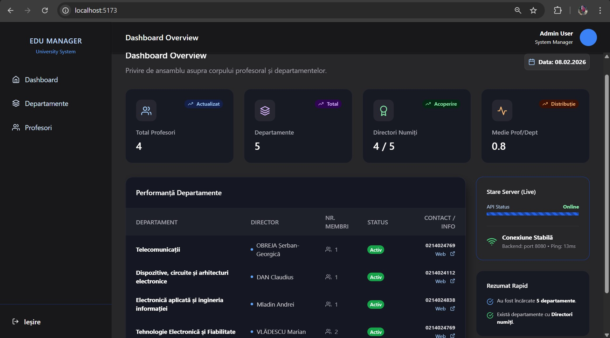
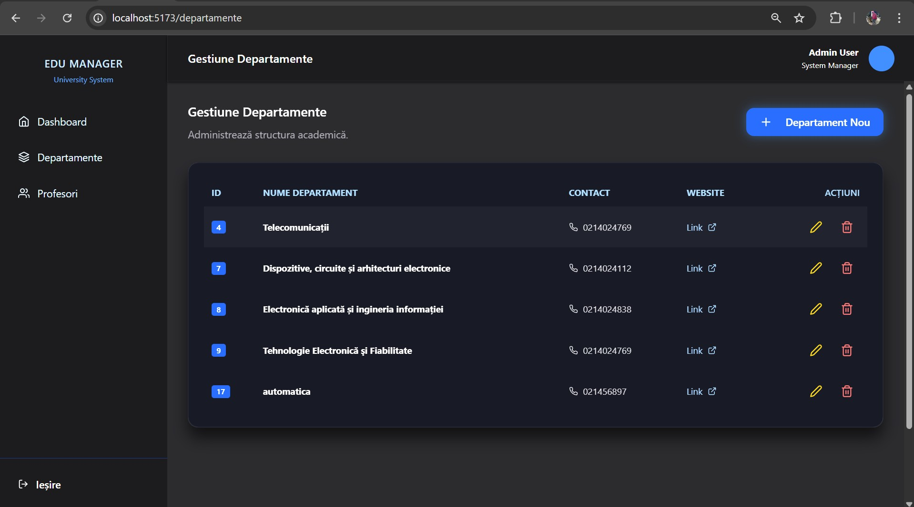
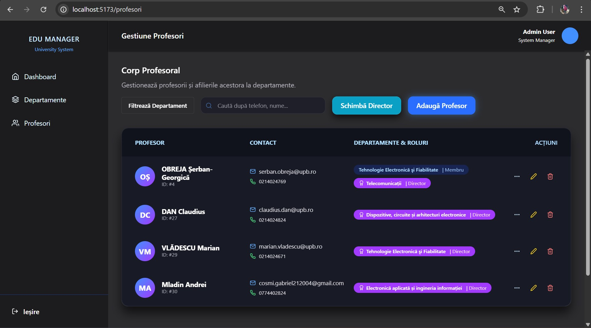
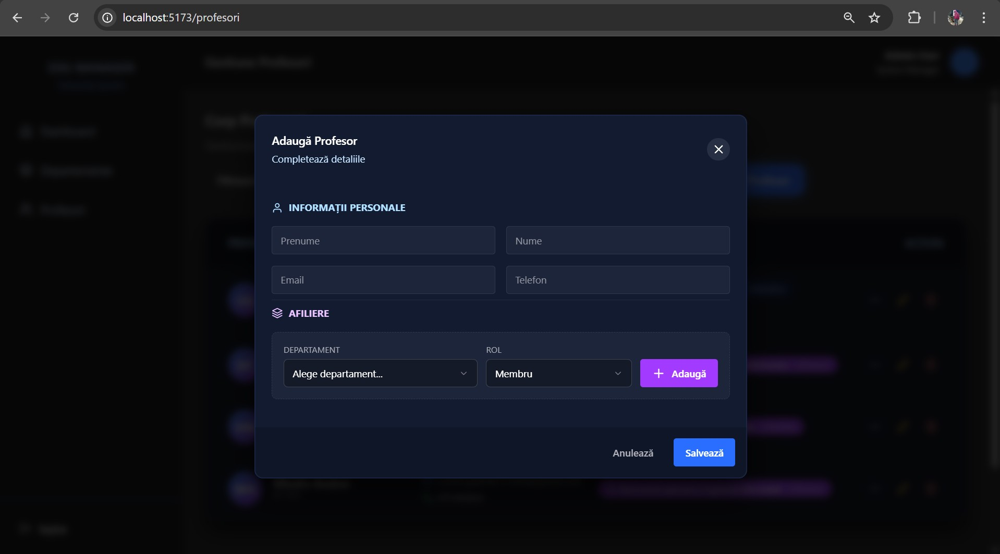
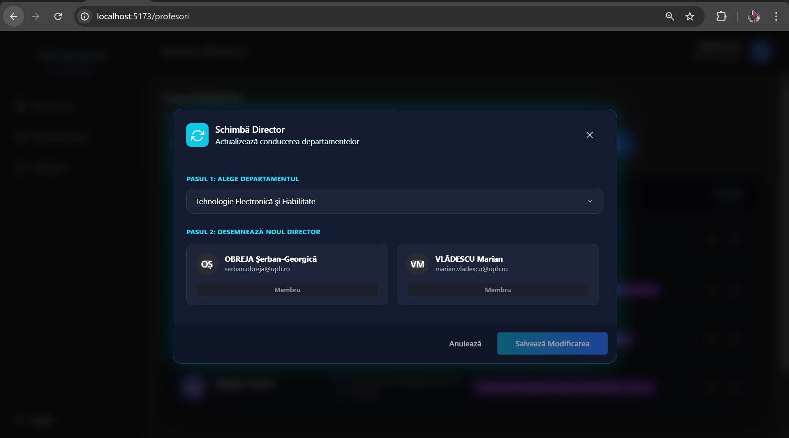
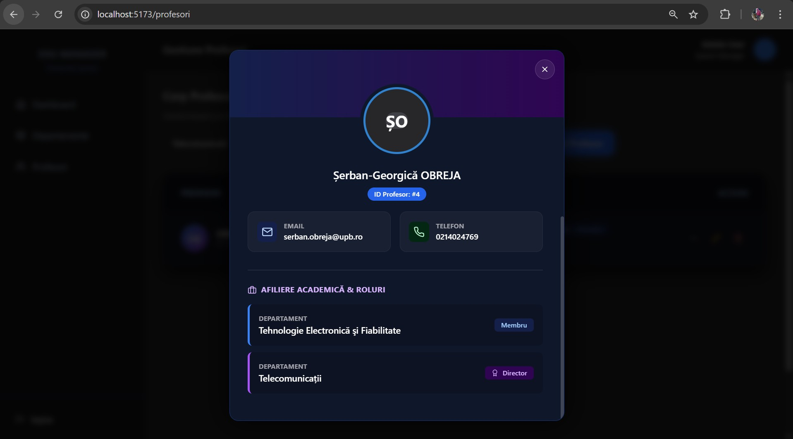
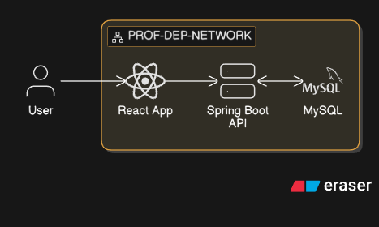

# 🎓 FullStack Academic Orchestrator
***Puteți accesa aplicația la adresa:*** http://63.182.19.214/

[](https://www.docker.com/)
[](https://aws.amazon.com/lightsail/)
[](https://hub.docker.com/u/cosmeenelul)
[](https://www.oracle.com/java/)
[](https://spring.io/projects/spring-boot)
[](https://reactjs.org/)
[](https://chakra-ui.com/)
[](https://vitejs.dev/)


Un sistem modern și performant de management pentru cadre didactice și departamente universitare. Proiectul demonstrează implementarea unei arhitecturi **Full-Stack** complet containerizate, care se află într-o rețea Docker, migrată din mediul de dezvoltare local în **Cloud (AWS)** folosind Amazon Lightsail și un flux de lucru de tip CI/CD manual.

## 📷 Imagini Demo ale Aplicației








## 📷 Arhitectura Rețelei


## 🛠️ Stack Tehnologic

### **Backend**
* **Framework:** Spring Boot 3
* **Limbaj:** Java 17
* **Persistență:** Spring Data JPA (Hibernate)
* **Bază de date:** MySQL 8.0
* **Management Dependențe:** Maven

### **Frontend**
* **Limbaj:** JavaScript
* * **Framework:** React 18
* * **Librarie:** Chakra UI
* **Build Tool:** Vite 
* **Server Producție:** Nginx
* **Client HTTP:** Fetch API

## ⚙️ Infrastructure & DevOps Architecture

* **Orchestrare Multi-Container:** Utilizarea **Docker Compose** pentru definirea și gestionarea întregului stack și pentru deploy pe server.
* **Repository Containere:** Am utilizat *Docker Hub* pentru a urca imaginile create local, ulterior folosind-ule pentru un deploy rapid si fluid.
* **Imagini Optimizate (Multi-Stage Builds):** Implementarea strategiei de *Multi-Stage Build* pentru a separa mediul de compilare de cel de rulare, rezultând imagini de producție de dimensiuni reduse și securitate sporită.
* **Networking Izolat & Securizat:** Arhitectură de rețea privată de tip *bridge*, care izolează baza de date și backend-ul de accesul public. Comunicarea între servicii se realizează exclusiv prin DNS-ul intern Docker.
* **High Availability & Auto-Healing:** Configurare de politici de restart (`on-failure`) și mecanisme de **Healthcheck**, asigurând repornirea automată a serviciilor în caz de erori critice.
* **Cloud Performance Tuning:** Optimizarea instanței VPS prin configurarea de **Virtual Memory (SWAP)** pentru a gestiona eficient consumul de resurse al JVM-ului și al bazei de date.

---

## 🚀 Pornirea Rapidă (Quick Start)

Aveți nevoie de Docker instalat, dar nu este necesară instalarea locală a Java, Node.js sau MySQL. Proiectul este complet automatizat prin Docker.

### Deploy rapid (producție/server)
```bash
cd mysql-init/
docker compose up -f docker-compose.prod.yaml -d
docker ps
```


### Deploy rapid (local)
```bash
git clone [https://github.com/username-ul-tau/FullStack-Academic-Orchestrator.git](https://github.com/username-ul-tau/FullStack-Academic-Orchestrator.git)
cd FullStack-Academic-Orchestrator
docker compose up -d --build
docker ps
```


### **Accesare Web App Local:** http://localhost
### **Accesare Web App Producție:** http://IP-UL TAU PUBLIC


## 🏗️ Arhitectura de Rețea Docker

Proiectul utilizează o rețea de tip `bridge` izolată, numită `prof-dep-network`, care permite comunicarea securizată între containere folosind rezoluția numelui (DNS intern).


### 🖥️ Servicii și Fluxul de Date

* **Frontend (Nginx):**
    * **Rol:** Servește fișierele statice rezultate din build-ul de React (Vite).
    * **Networking:** Ascultă pe portul `80` în interiorul rețelei Docker, și este mapat pe portul **`80`**.
* **Backend (Spring Boot):**
    * **Rol:** Gestionează logica de business și expune endpoint-urile REST.
    * **Networking:** Comunică cu baza de date folosind direct numele containerului: `mysql-prof-dep-container` pe portul `3306`.
* **Database (MySQL):**
    * **Rol:** Stocarea persistentă a datelor despre profesori și departamente.
    * **Persistență:** Utilizează un volum Docker persistent numit `mysql-data-prof-dep`. Aceasta asigură că datele rămân intacte chiar dacă se opresc containerele.
    * **Acces extern:** Este mapat pe portul **`3307`** pe host pentru a permite interogări

---

## 📂 Persistența Datelor (Docker Volumes)

Pentru a asigura integritatea datelor, am implementat un volum extern gestionat de Docker:

```yaml
volumes:
  mysql-data-prof-dep:
    driver: local
