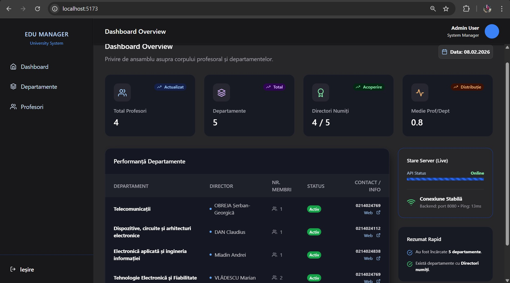
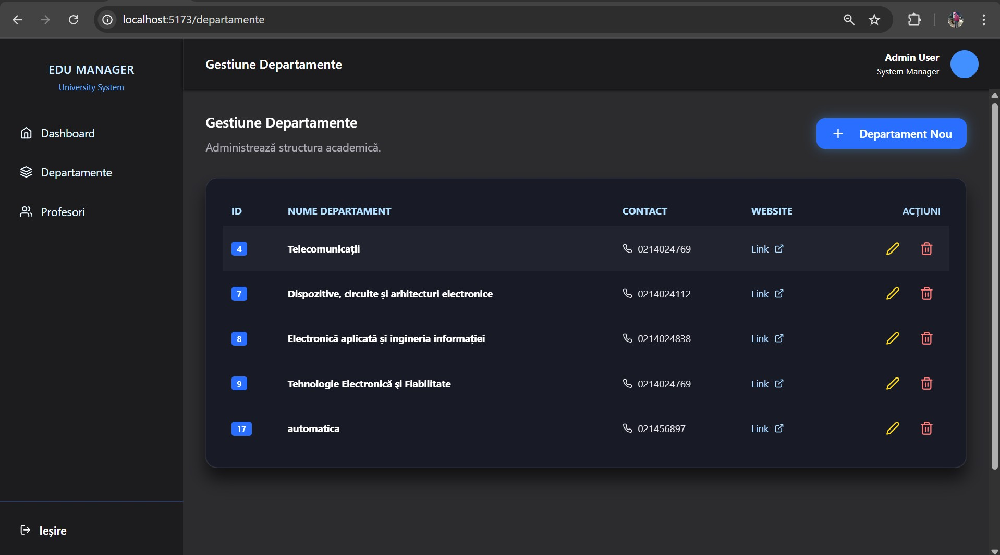
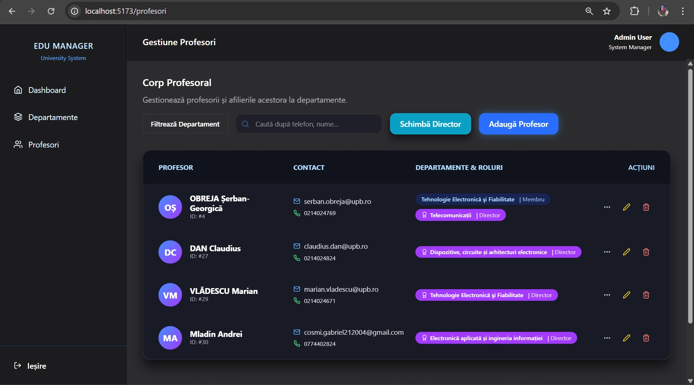
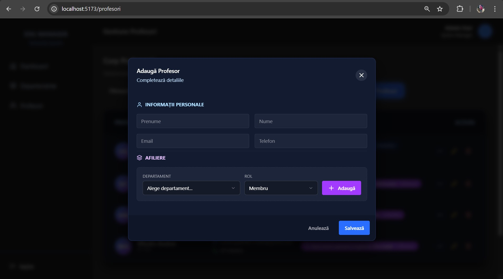
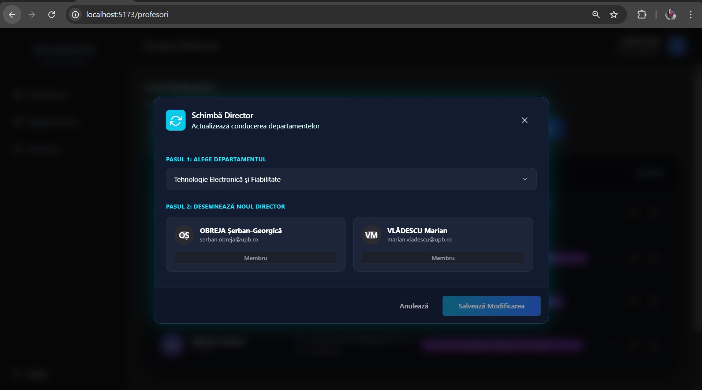
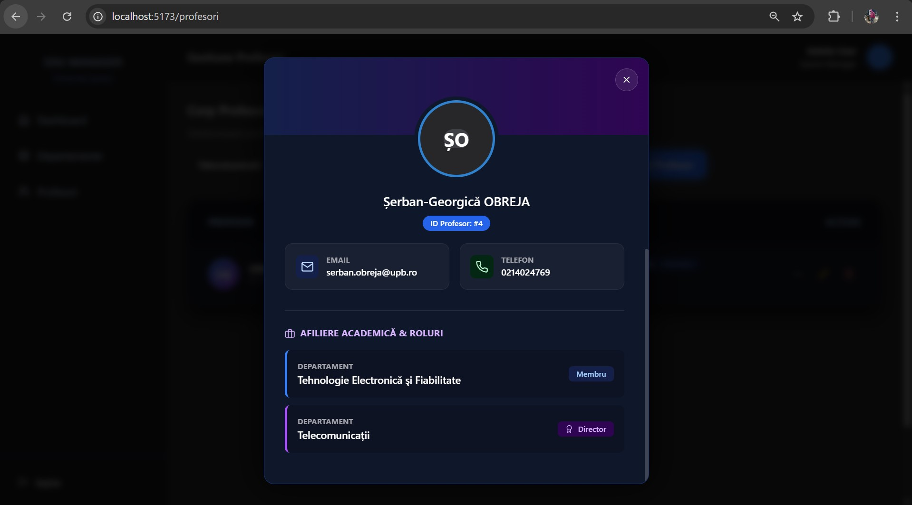
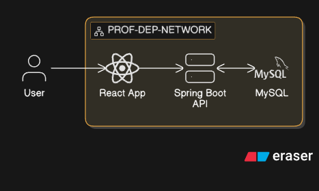

# 🎓 FullStack Academic Orchestrator
***Puteți accesa aplicația la adresa:*** http://63.182.19.214/

[](https://www.docker.com/)
[](https://aws.amazon.com/lightsail/)
[](https://github.com/features/actions)
[](https://hub.docker.com/u/cosmeenelul)
[](https://www.oracle.com/java/)
[](https://spring.io/projects/spring-boot)
[](https://reactjs.org/)
[](https://chakra-ui.com/)
[](https://vitejs.dev/)


Un sistem  management pentru cadre didactice și departamente universitare. Proiectul implementeaza o arhitectura Full-Stack complet **containerizata**, orchestrata prin **Docker Compose** și gazduita în **Cloud (AWS Lightsail)**. Ciclul de viata al aplicatiei este sustinut de un **pipeline CI/CD** complet automatizat prin **GitHub Actions**, eliminand nevoia de deployment manual.

## 📷 Imagini Demo ale Aplicației








## 📷 Arhitectura Rețelei


## 🛠️ Stack Tehnologic

### **Backend**
* **Framework:** Spring Boot 3
* **Limbaj:** Java 17
* **Persistență:** Spring Data JPA (Hibernate)
* **Bază de date:** MySQL 8.0
* **Management Dependențe:** Maven

### **Frontend**
* **Limbaj:** JavaScript
* * **Framework:** React 18
* * **Librarie:** Chakra UI
* **Build Tool:** Vite 
* **Server Producție:** Nginx
* **Client HTTP:** Fetch API


### **DevOps & Cloud**
* **CI/CD:** GitHub Actions
* **Containerizare:** Docker & Docker Compose
* **Container Registry:** Docker Hub
* **Cloud Provider:** Amazon Web Services (AWS Lightsail)
* **OS Server:** Linux (Ubuntu)


## ⚙️ Infrastructure & Automated CI/CD Pipeline

Acest proiect foloseste practicile moderne de DevOps, folosind **GitHub Actions** pentru a automatiza complet fluxul de la cod la productie:

* **Continuous Integration (CI):** La fiecare push pe branch-ul `main`, pipeline-ul declanseaza automat build-ul aplicației de Spring Boot (Maven) și a celei de React (Vite).
* **Automated Docker Registry Push:** Imaginile sunt construite și urcate automat pe **Docker Hub**.
* **Continuous Deployment (CD) via SSH:** Pipeline-ul se conecteaza securizat (prin GitHub Secrets) la instanta **AWS Lightsail**, actualizeaza fisierul `docker-compose.yaml` și forteaza serverul sa faca *pull* noilor imagini, repornind containerele cu noile modificari.
* **Networking Izolat & Securizat:** Arhitectura de rețea privată de tip *bridge*, care izolează baza de date și backend-ul de accesul public.
* **High Availability & Auto-Healing:** Configurare de politici de restart (`always` / `on-failure`), asigurând repornirea automată a serviciilor în caz de erori critice sau restart al serverului.

---

## 🚀 Pornirea Rapidă (Quick Start)

Aveți nevoie de Docker instalat, dar nu este necesară instalarea locală a Java, Node.js sau MySQL. Proiectul este complet automatizat prin Docker.

### Deploy în Producție (Complet Automatizat)
In urma integrarii cu **GitHub Actions**, orice `git push` pe branch-ul `main` declanseaza automat:
1. Build-ul imaginilor.
2. Push către Docker Hub.
3. Conectarea SSH pe AWS Lightsail și rularea comenzilor de `docker compose pull && docker compose up -d`.
*Nu este necesară nicio intervenție manuală pe server!*


### Deploy rapid (local)
```bash
git clone [https://github.com/username-ul-tau/FullStack-Academic-Orchestrator.git](https://github.com/username-ul-tau/FullStack-Academic-Orchestrator.git)
cd FullStack-Academic-Orchestrator
docker compose up -d --build
docker ps
```


### **Accesare Web App Local:** http://localhost
### **Accesare Web App Producție:** http://IP-UL TAU PUBLIC


## 🏗️ Arhitectura de Rețea Docker

Proiectul utilizează o rețea de tip `bridge` izolată, numită `prof-dep-network`, care permite comunicarea securizată între containere folosind rezoluția numelui (DNS intern).


### 🖥️ Servicii și Fluxul de Date

* **Frontend (Nginx):**
    * **Rol:** Servește fișierele statice rezultate din build-ul de React (Vite).
    * **Networking:** Ascultă pe portul `80` în interiorul rețelei Docker, și este mapat pe portul **`80`**.
* **Backend (Spring Boot):**
    * **Rol:** Gestionează logica de business și expune endpoint-urile REST.
    * **Networking:** Comunică cu baza de date folosind direct numele containerului: `mysql-prof-dep-container` pe portul `3306`.
* **Database (MySQL):**
    * **Rol:** Stocarea persistentă a datelor despre profesori și departamente.
    * **Persistență:** Utilizează un volum Docker persistent numit `mysql-data-prof-dep`. Aceasta asigură că datele rămân intacte chiar dacă se opresc containerele.
    * **Acces extern:** Este mapat pe portul **`3307`** pe host pentru a permite interogări

---

## 📂 Persistența Datelor (Docker Volumes)

Pentru a asigura integritatea datelor, am implementat un volum extern gestionat de Docker:

```yaml
volumes:
  mysql-data-prof-dep:
    driver: local
